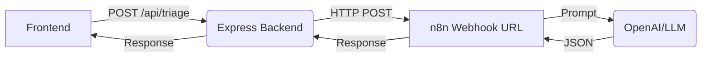

# MedEasy n8n Setup Guide

This guide explains how to replace the hardcoded AI logic in the Node.js backend with powerful **n8n workflows** using your preferred LLMs (OpenAI, Anthropic, or Local LLMs via Ollama).

## Prerequisites
1. **n8n Installed**: You can run n8n locally via Docker or npm, or use n8n Cloud.
   - Using npm: `npx n8n`
   - Using Docker: `docker run -it --rm --name n8n -p 5678:5678 -v ~/.n8n:/home/node/.n8n docker.n8n.io/n8nio/n8n`
2. **API Keys**: You'll need an API key for OpenAI, Anthropic, or similar.

---

## Architecture

Right now, the Node API (`server/routes/api.js`) contains fallback local logic for:
- `/api/insurance`
- `/api/triage`

We can wire these endpoints to **Webhook Nodes** in n8n.



---

## Workflow 1: AI Symptom Triage

1. **Create a new Workflow** in n8n.
2. **Add a Webhook Node**:
   - Method: `POST`
   - Path: `triage`
   - Respond: `Using 'Respond to Webhook' Node`
3. **Add an OpenAI Node** (or Basic LLM Node):
   - Action: `Chat`
   - Model: `gpt-4o-mini` (or your preferred model)
   - System Prompt:
     ```
     You are MedEasy Triage AI. Analyze the given symptoms and return a JSON object ONLY with the following schema:
     {
       "urgency": "emergency" | "urgent" | "routine",
       "title": "Short title",
       "message": "Detailed explanation",
       "action": "Recommended action (e.g. go to ER, book appointment)",
       "nextSteps": ["step 1", "step 2"],
       "carePathway": "Specialty needed"
     }
     ```
   - User Message: `={{$json.body.symptoms}}`
4. **Add a 'Respond to Webhook' Node**:
   - Respond With: `JSON`
   - Response Body: `={{$json.message.content}}`
5. **Activate the Workflow** and get the Production URL (e.g., `http://localhost:5678/webhook/triage`).
6. **Update the Express Backend**:
   In `server/routes/api.js`, update the triage route to proxy to n8n:
   ```javascript
   router.post('/triage', async (req, res) => {
     try {
       const response = await fetch('http://localhost:5678/webhook/triage', {
         method: 'POST',
         headers: { 'Content-Type': 'application/json' },
         body: JSON.stringify(req.body)
       });
       const data = await response.json();
       res.json(data);
     } catch (err) {
       // Fallback logic
     }
   });
   ```

---

## Workflow 2: Insurance Policy Explainer

1. **Create a new Workflow**.
2. **Add a Webhook Node**:
   - Method: `POST`
   - Path: `insurance`
3. **Add an AI Node** (Agents / Chat Model):
   - You can connect a **Vector Store** or **Document Loader** node here if you want the AI to read actual PDF policies.
   - For a simpler setup, pass the plan details into the prompt:
     User Message: `Query: {{$json.body.query}} \n Plan Details: {{$json.body.plan}}`
4. **Add a 'Respond to Webhook' Node**:
   - Respond With: `JSON`
   - Body: `{ "answer": "={{$json.message.content}}" }`
5. **Update the Express Backend**:
   Proxy the `/api/insurance` route to your `http://localhost:5678/webhook/insurance` endpoint just like the triage route.

---

## Next Steps for Advanced n8n Integration

- **Hospital Search**: Create an n8n workflow that fetches data from a real health API or Google Maps API to return in-network hospitals.
- **Booking Agent**: Create an n8n workflow that uses a tool to actually insert the booking into a Google Calendar or an EMR system.
